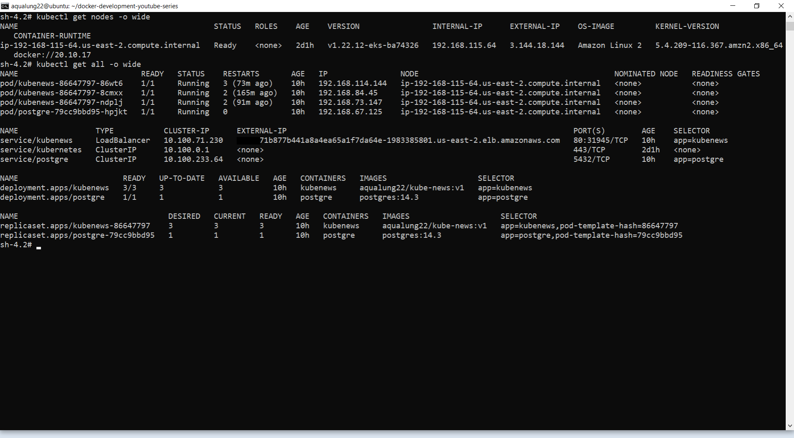

# Implementação de um cluster Kubernetes na AWS EKS via AWS CLI

Implementação de um cluster Kubernetes na AWS EKS via AWS CLI

* Criado um container Docker com AWS CLI
* Criadas Security Credentials para autenticar na AWS .
* Selecionada uma região da AWS.
* Configurado o login via credenciais.
* Criada uma role EKS Cluster IAM no console AWS para interagir com a cloud.
* Criada uma managed policy , associada a uma IAM role, para gerir o cluster AWS EKS
* Criado uma VPC utilizando o template da CloudFormation e, associada a ela, uma role, subnets, security groups e definida a visibilidade de acesso à VPC.
* Efetuado o deploy do template AWS CloudFormation
* Configurado o kubeconfig para operação do cluster remoto.
* Efetuado o deploy de um cluster Kubernetes na AWS EKS com uma aplicação NodeJs com banco PostgreSQL.

